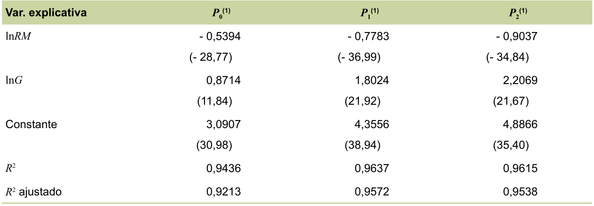
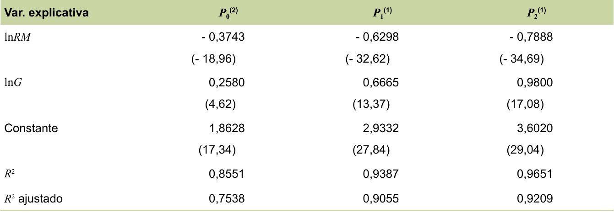
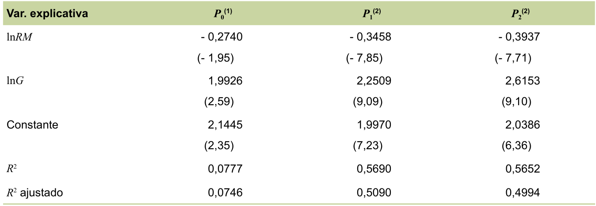

<!-- _paginate: false -->
<!-- _backgroundImage: "linear-gradient(to top left, #f90083, #F90083)" -->
<!-- _color: #FFFFFF -->

# Elasticidade-renda e elasticidade-desigualdade da pobreza no Nordeste brasileiro

 
 

**Autores:**
Jair Andrade de Araújo
Francisco José Tabosa
Ahmad Saeed Khan

---

- Ineficiência do Nordeste em acompanhar as outras regiões em índices de pobreza.

- O Censo de 1960 possibilitou estudar diversos temas: pobreza, crescimento econômico e desigualdade.

- Dentre as principais causas da pobreza:

  - Diferenças intrínsecas (raça, gênero, inteligência, riqueza inicial);

  - Diferenças adquiridas (nível educacional, experiência profissional);
  
  - Acesso ao crédito;
  
  - Fatores demográficos (meio urbano e rural, formação de domicílio, de fertilidade, coabitação ou separação domiciliar).
---

**Tabela 1** - Número de indivíduos pobres no Brasil e suas regiões.

<table>
<thead>
  <tr>
    <th rowspan="2" class="head">Região</th>
    <th colspan="4" class="head">Ano</th>
  </tr>
  <tr>
    <th class="head">1995</th>
    <th class="head">2001</th>
    <th class="head">2005</th>
    <th class="head">2008</th>
  </tr>
</thead>
<tbody>
  <tr class="line">
    <td class="cell title"><b>Centro-Oeste</b></td>
    <td class="cell">2.732.552</td>
    <td class="cell">3.003.663</td>
    <td class="cell">2.664.071</td>
    <td class="cell">1.682.270</td>
  </tr>
  <tr class="line">
    <td class="cell title"><b>Norte</b></td>
    <td class="cell">3.114.296</td>
    <td class="cell">4.410.528</td>
    <td class="cell">6.148.868</td>
    <td class="cell">4.860.753</td>
  </tr>
  <tr class="line">
    <td class="cell title"><b>Nordeste</b></td>
    <td class="cell">26.231.589</td>
    <td class="cell">28.719.015</td>
    <td class="cell">27.327.747</td>
    <td class="cell">22.011.073</td>
  </tr>
  <tr class="line">
    <td class="cell title"><b>Sul</b></td>
    <td class="cell">6.083.134</td>
    <td class="cell">6.194.775</td>
    <td class="cell">4.968.278</td>
    <td class="cell">3.382.090</td>
  </tr>
  <tr class="line">
    <td class="cell title"><b>Sudeste</b></td>
    <td class="cell">13.622.855</td>
    <td class="cell">16.160.921</td>
    <td class="cell">14.367.748</td>
    <td class="cell">9.524.733</td>
  </tr>
  <tr>
    <td class="foot title"><b>Brasil</b></td>
    <td class="foot">51.784.426</td>
    <td class="foot">58.488.902</td>
    <td class="foot">55.476.712</td>
    <td class="foot">41.460.919</td>
  </tr>
  <tr>
    <td class="foot title"><b>Nordeste/Brasil (em %)</b></td>
    <td class="foot">50,66</td>
    <td class="foot">49,10</td>
    <td class="foot">49,26</td>
    <td class="foot">53,09</td>
  </tr>
</tbody>
</table>

<small>Fonte: Dados do Ipea (2011)</small>

---

- Decrescimento de 1970 à 1985.

- Crescimento de 1986 à 1995.

- Estabilidade a partir de 1996.

- Segundo Carneiro(2003), houve no Nordeste, uma maior porcentagem da pobreza na área rural.

- As elasticidades são instrumentos essenciais de políticas públicas.

---
<!-- _color: #FFFFFF -->
<!-- _backgroundImage: "linear-gradient(to top left, #f90083, #F90083)" -->
<!-- _paginate: false -->

# Revisão de literatura

- Barreto (2005) diz que o combate à pobreza deve ser mais acompanhado da diminuição da desigualdade do que da expansão da renda.

- Silveira Neto (2005) diz que mesmo a renda média crescendo, ainda sim não será tão eficaz no combate a pobreza.

- Siqueira e Siqueira (2006) menciona que o Nordeste continua sendo a região mais desigual do país.

---

<h1 class="pink">Base de Dados</h1>

- Pesquisa Nacional por Amostragem Domiciliar (Pnad) de 1995 à 2009 <a href="#fn1" id="fnref1">[1]</a>, publicadas pelo IBGE em 2009. <a href="#fn2" id="fnref2">[2]</a>

- A variável renda é a renda familiar per capita extraída da Pnad, que é calculada dividindo-se o rendimento total da família pelo seu número de componentes. Em seguida, foi calculada a renda média dos estados, utilizando a média aritimética dessa variável.

<section class="footnotes">
<ol class="footnotes-list">
<li id="fn1" class="footnote-item footnote-text">

A Pnad não foi realizada no ano de 2000. Para preencher essa lacuna, resolvou-se tirar as médias  das variáveis dos anos 1999 e 2001. <a href="#fnref1" class="footnote-backref">↩</a>

</li>

<li id="fn2" class="footnote-item footnote-text">

As áreas rurais e urbanas utilizadas no presente estudo foram das novas delimitações que o IBGE passou a utilizar a partir do ano 2000. <a href="#fnref2" class="footnote-backref">↩</a>

</li>
</ol>
</section>

---

- Todas variáveis monetárias do artigo foram ajustados à valores reais de 2009, pelo INPC (índice nacional de preços ao consumidor) de 2009.

- O artigo classifica como pobres, as famílias que vivem com renda familiar per capita insuficiente para satisfazer suas necessidades básicas.

- A linha de pobreza adotada foi a de $\frac{1}{2}$ salário mínimo.

- Utilizou indicadores de pobreza absoluta proposta por Foster et al.(1984):

---

Sendo $n$ o total de indivíduos e $q$ o número de pessoas com renda per capita familiar $y_i$ , abaixo da linha de pobreza $z$. Temos:

- Proporção de pobres:
  $$P_0 = \frac{q}{n}$$

- Hiato médio da pobreza:
  $$P_1 = \frac{1}{n} \sum_{i=1}^{q} \left(\frac{z-y_i}{z} \right)$$

- Hiato médio quadrático da pobreza:
  $$P_2 = \frac{1}{n} \sum_{i=1}^{q} \left(\frac{z-y_i}{z} \right)^2$$

---

A medida de desigualdade de renda utilizada foi o **índice de Gini**, oriundo da renda per capita extraída das Pnads.

<b>Índice de Gini</b>: Frequentemente utilizado para expressar o grau de desigualdade de renda, pode ser associado à <b>curva de Lorenz</b>, que é definida pelo conjunto de pontos que, a partir das rendas ordenadas de forma crescente, relacionam a proporção acumulada de pessoas e a proporção acumulada de renda.

---

<h1 class="pink"> Modelo econométrico </h1>

Foi utilizado um painel equilibrado e dois tipos de especificações:

- Modelo de efeitos fixos.

- Modelo de efeitos aleatórios.

$$
\ln Pj_{i,t} = \alpha_{i,t} + \beta_{1} \ln RM_{i,t} + \beta_{2} \ln G_{i,t} + \varepsilon_{i,t}
$$

em que

$\ln Pj_{i,t} =$ logaritmo natural de $P_j$ do estado $i$ no período $t$.

$\ln RM_{i,t} =$ logaritmo natural da renda média per capita do estado $i$ no período $t$.

$\ln G_{i,t} =$ logaritmo natural do índice de Gini do estado $i$ no período $t$.

---

$j = 0$ (proporção de pobres), 1 (hiato médio da pobreza) e 2 (hiato quadrático da pobreza).

$\beta_1 =$ elasticidade-renda da pobreza.

$\beta_2 =$ elasticidade-desigualdade da pobreza.

$i =$ estados $(1, ..., 9)$.

$t =$ períodos $(1995, ..., 2009)$.

---
<h1 class="pink">Resultados</h1>

**Tabela 2** - Elasticidade-renda da pobreza e elasticidade-desigualdade da pobreza no Nordeste (área total), no período de 1995 e 2009.

---

- Quando se considera a área total, em termos de $P_0$, temos que a redução da desigualdade é mais efetiva do que o crescimento da renda média para diminuir a proporção de pobres.

- Enquanto um aumento de 10% na renda média está associado a uma diminuição de 5,394% na proporção de pobres, uma diminuição de 10% na desigualdade se associa a uma diminuição de 8,714% na proporção de pobres. 

---

- No que concerne ao hiato médio da pobreza, a redução da desigualdade se apresenta mais efetiva do que o crescimento da renda média para diminuir o indicador. Um aumento de 10% na renda média, reduz em 7,783% o hiato médio da pobreza, enquanto uma redução de 10% da desigualdade reduz o hiato em 18,024%.

- Já em termos de hiato quadrático da pobreza, mais uma vez a redução da desigualdade é mais efetiva na redução do que o crescimento da renda média. Um aumento de 10% na renda média está associado a uma diminuição de 9,037% no hiato quadrático da pobreza, enquanto uma redução de 10% da desigualdade gera uma diminuição em 22,069% no hiato quadrático da pobreza.

---

**Tabela 3** - Elasticidade-renda da pobreza e elasticidade-desigualdade da pobreza no Nordeste, em áreas rurais, no período de 1995 a 2009.

---

- Quando se considera a área rural, em termos de $P_0$ temos que o aumento da renda média é mais efetivo do que redução da desigualdade para diminuir a proporção de pobres. Enquanto um aumento de 10% na renda média está associado a uma diminuição de 3,743% na proporção de pobres, uma diminuição de 10% na desigualdade se associa a uma diminuição de 2,580% na proporção de pobres.

- No que concerne a o hiato médio da pobreza, a redução da desigualdade se apresenta mais efetiva do que o crescimento da renda média para diminuir o indicador. Um aumento de 10% na renda média, reduz em 6,296%  o hiato médio da pobreza, enquanto uma redução de 10% da desigualdade reduz o hiato em 6,665%.

---

- Já em termos de hiato quadrático da pobreza, a redução da desigualdade também é mais efetiva na redução do que o crescimento da renda média. Um aumento de 10% na renda média está associado a uma diminuição de 7,888% no hiato quadrático da pobreza, enquanto uma redução de 10% da desigualdade gera uma diminuição em 9,800% no hiato quadrático da pobreza.

---

**Tabela 4** - Elasticidade-renda da pobreza e elasticidade-desigualdadedeste, no período de 1995 a 2009.

---

- Quando se considera a urbana, em termos de P0 temos que a redução da desigualdade é mais efetiva do que o crescimento da renda média para diminuir a proporção de pobres. Enquanto um aumento de 10% na renda média está associado a uma diminuição de 2,740%  na proporção de pobres, uma diminuição de 10% na desigualdade se associa a uma diminuição de 19,926% na proporção de pobres.

- No que concerne a o hiato médio da pobreza, a redução da desigualdade se apresenta mais efetiva do que o crescimento da renda média para diminuir o indicador. Um aumento de 10% na renda média, reduz em 3,458% o hiato médio da pobreza, enquanto uma redução de 10% da desigualdade reduz o hiato em 22,509%.

---

- Já em termos de hiato quadrático da pobreza, mais uma vez a redução da desigualdade é mais efetiva na redução do que o crescimento da renda média. Um aumento de 10% na renda média está associado a uma diminuição de 3,937% no hiato quadrático da pobreza, enquanto uma redução de 10% da desigualdade gera uma diminuição em 26,153% no hiato quadrático da pobreza.

---

<h1 class=pink> Conclusão </h1>

- As elasticidades-renda da pobreza são maiores nas áreas rurais do que nas áreas urbanas. 

- Em linha contrária, as elasticidades-desigualdade da pobreza são maiores nas áreas urbanas do que nas áreas rurais.

- Independente da área, as elasticidades-renda da pobreza apresentaram coeficientes menores do que 1, o que indica que o crescimento impacta desproporcionalmente os pobres. Se diz que não está havendo crescimento pró-pobre.

---

- No geral, políticas de redução da desigualdade foram mais efetivas do que políticas de crescimento da renda média.

- Dado que os todos os coeficientes foram significativos, nota-se a necessidade de combinar políticas de crescimento da renda média com políticas de redução da desigualdade. 

---
<!-- _color: #FFFFFF -->
<!-- _backgroundImage: "linear-gradient(to top left, #f90083, #F90083)" -->
<!-- _paginate: false -->

# Principais referências do artigo

BARRETO, F. A. F. D. **Crescimento econômico, pobreza
e desigualdade de renda: o que sabemos sobre eles?**
Fortaleza: LEP-CAEN, 2005. 18 p. (Série Ensaios sobre
Pobreza, n. 1).

FOSTER, J.; GREER, J.; THORBECKE, E. A class of
decomposable poverty measures. **Econometrica**, Evaston,
v. 52, n. 3, p. 761-766, 1984.

HOFFMANN, R.; DUARTE, J. B. A distribuição da renda
no Brasil. **Revista de Administração de Empresa**, Rio de
Janeiro, v. 2, p. 46-66, 1972.

IBGE. Instituto Brasileiro de Geografia e Estatística.
**Pesquisa Nacional por Amostra de Domicílios (PNAD):**
1995-2009. Rio de Janeiro, 2009. 1 CD-ROM.

---

<!-- _paginate: false -->

---

<!-- _color: #FFFFFF -->
<!-- _backgroundImage: "linear-gradient(to top left, #f90083, #F90083)" -->
<!-- _paginate: false -->

Pedro Henrique Ferreira de Souza

Flávio Hugo Pangrácio Silva

Adrian Luis Pereira da Silva Rocha

<!-- 

  

  <h1 class="pink">#OutubroRosa</h1>

 -->